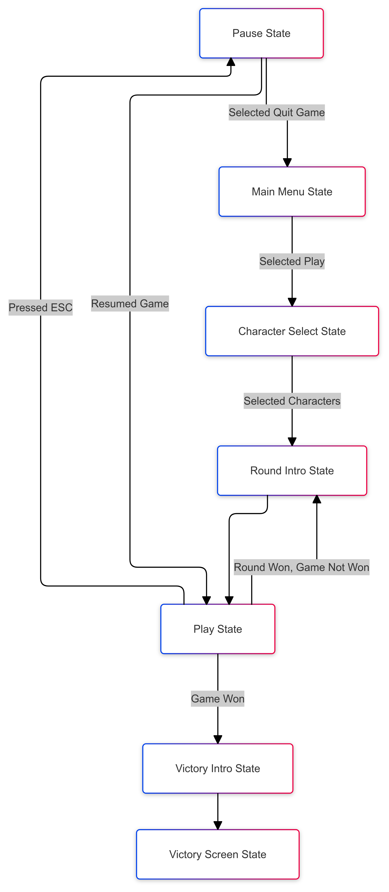

## Motion Inputs
[Input system and parser based on this](https://mugen-net.work/wiki/index.php?title=Deep_Buffering#Algorithm)

### Before Submitting:
- Change Starting State in StateMachine constructor to main menu state

### TODO
- Work on player class
- Create Fight class to hold 2 players and add it to PlayState as a member
- Command parser
  - Add Command abstract class
  - Has command sequence field
  - Has check for input method

### Files with TODOs
- Player.h
- Fight.h & Fight.cpp

## Play State
### TODO
- Fields
  - Player1 (Player)
  - Player2 (Player)
  - UserInterface (UserInterface)
- Methods
  - Update
  - Render

## States Relationship

